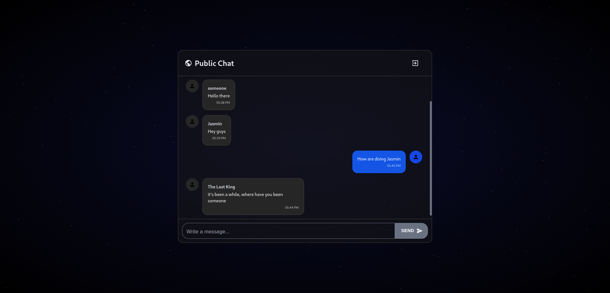

# 📝 Public Chat Web Application



A real-time public chat application built with React and TypeScript for the frontend, and Express, TypeORM, and PostgreSQL for the backend. Messages and user accounts are temporary: accounts and messages are automatically deleted after 24 hours, and messages are limited to 20 per user.

## Features
- Real-time chat using Socket.IO
- Temporary user accounts stored in localStorage (deleted after 24 hours)
- Automatic deletion of messages after 24 hours or when exceeding 20 messages per user
- REST API backend for message and user management

## Tech Stack
- **Backend:** ExpressJs, TypeScript, TypeORM, Cors, dotenv, pg, reflect-metadata, socket.io, typeorm, zod, Yarn
- **Database:** PostgreSQL
- **Frontend:** React, Material UI, tailwindcss, socket.io, Axios

## Prerequisites
- [Node.js](https://nodejs.org/)
- [Yarn](https://yarnpkg.com/)

## Installation
I. Clone the repository:
   ```bash
   git clone https://github.com/l1l-01/public-chat.git
   cd public-chat
   ```
# Backend

1. Navigate to the backend folder
   ```bash
   cd server
   ```

2. Create a .env file with the following configuration:
   ```bash
   PORT=3000
   DB_HOST=localhost
   DB_PORT=5432
   DB_USER=<your_db_user>
   DB_PASS=<your_db_password>
   DB_NAME=<your_db_name>
   NODE_ENV=development
   ```

2. Install dependencies:
   ```bash
   yarn install
   ```

3. Build the backend:
   ```bash
   yarn build
   ```

4. Start the application:
   ```bash
   node dist/server.js
   ```

# Frontend

1. Navigate to the frontend folder
   ```bash
   cd client
   ```

2. Install dependencies:
   ```bash
   npm install
   ```

3. Start the application:
   ```bash
   npm run dev
   ```

## Usage
- Navigate to `http://localhost:5173/` in your browser, register and start chatting.

## Project Structure
- `client/`: Frontend
- `server/`: Backend

## Note:
- This project includes a StarryBackground React component that creates a live starry sky effect: The number of stars (i) controls how many stars are created, Do not increase it higher than 300, as this can significantly impact browser and pc performance.


## License

This project is open-source and free to use.
